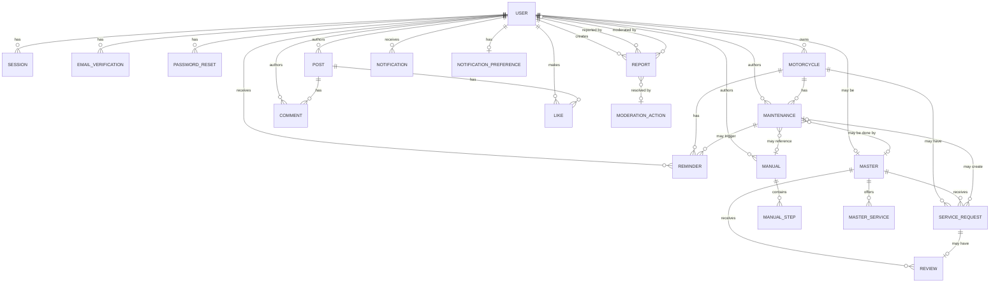

# MotoBind v2 — Domain Model

> Версия: 1.0
> Дата: октябрь 2026
> Статус: draft

## 1. Ubiquitous Language

Единый словарь проекта. Одно понятие — одно слово.

| Термин | Значение | Избегаем |
|---|---|---|
| User | Человек с аккаунтом | Account, Person |
| Session | Активная сессия (refresh) | Token |
| Motorcycle | Конкретный мотоцикл в гараже | Moto, Bike |
| Maintenance | Запись обслуживания | Service, ТО |
| MaintenanceItem | Работа внутри записи | — |
| Reminder | Напоминание (сущность) | Notification |
| Notification | In-app уведомление | — |
| Manual | Пошаговая инструкция | Guide |
| ManualStep | Шаг мануала | — |
| Article | Статья (без шагов) | Post |
| Master | B2B-профиль мастера | Specialist |
| ServiceRequest | Заявка клиента мастеру | Booking |
| Review | Отзыв о мастере | Rating |
| Post | Пост в соцсети | — |
| Comment | Комментарий к посту | — |
| Like | Лайк поста | — |
| Report | Жалоба на контент | Complaint |
| ModerationAction | Действие модератора | — |

**Важно:** `Reminder` и `Notification` — разные сущности. `Reminder` — «пора обновить пробег», живёт долго, имеет статус. `Notification` — событие «вам пришло напоминание», показывается в колокольчике.

---

## 2. Bounded Contexts

| Identity | Garage | Knowledge | Community |
|---|---|---|---|
| User | Motorcycle | Manual | Post |
| Session | Maintenance | ManualStep | Comment |
| EmailVerification | MaintenanceItem | Article (P2) | Like |
| PasswordReset | Reminder | Training (P2) | — |
| | Expense (P1) | | |

| Marketplace | Moderation | Notification |
|---|---|---|
| Master | Report | Notification |
| MasterService | ModerationAction | NotificationPreference |
| ServiceRequest | | |
| Review | | |

**Правило:** контексты общаются только через `user_id` и другие ID. Никаких FK между контекстами напрямую.

---

## 3. Контексты

### 3.1. Identity

**Ответственность:** кто пользователь, как аутентифицируется, какие у него права.

**Сущности:** `User`, `Session`, `EmailVerification`, `PasswordReset`.

#### User

| Поле | Тип | Примечание |
|---|---|---|
| id | UUID | PK |
| email | string | UK, lowercase |
| username | string | UK |
| password_hash | string | bcrypt, cost ≥ 12 |
| roles | Set[Role] | user \| master \| moderator \| admin |
| status | enum | pending_verification \| active \| banned \| deleted |
| is_verified | bool | email подтверждён |
| email_verified_at | timestamp \| null | |
| last_login | timestamp \| null | |
| created_at | timestamp | |
| updated_at | timestamp | |

#### Session

| Поле | Тип | Примечание |
|---|---|---|
| id | UUID | PK |
| user_id | UUID | FK → User |
| refresh_token_hash | string | UK |
| user_agent | string | |
| ip_address | string | |
| created_at | timestamp | |
| expires_at | timestamp | |
| used_at | timestamp \| null | для ротации |
| revoked_at | timestamp \| null | |
| last_active_at | timestamp | |

#### EmailVerification

| Поле | Тип | Примечание |
|---|---|---|
| id | UUID | PK |
| user_id | UUID | FK → User |
| token_hash | string | UK |
| purpose | enum | email_verify \| email_change_old \| email_change_new |
| expires_at | timestamp | |
| used_at | timestamp \| null | |
| invalidated_at | timestamp \| null | |
| created_at | timestamp | |

#### PasswordReset

| Поле | Тип | Примечание |
|---|---|---|
| id | UUID | PK |
| user_id | UUID | FK → User |
| token_hash | string | UK |
| expires_at | timestamp | |
| used_at | timestamp \| null | |
| invalidated_at | timestamp \| null | |
| created_at | timestamp | |

**Инварианты:**
- Email уникален, регистронезависим.
- Username уникален, регистрозависим.
- Пароль ≥ 8 символов.
- Один активный токен `EmailVerification` в рамках `purpose`.
- `PasswordReset` одноразовый, атомарный `used_at`.
- При сбросе пароля — все Session отзываются.
- При смене пароля/email — все Session, кроме текущей, отзываются.
- Последний `admin` не может быть удалён или разжалован.

**P1 (не в v2):** `EmailChangeRequest`, `EmailChangeHistory`, `LoginAttempt`, 2FA.

---

### 3.2. Garage

**Ответственность:** всё, что связано с мотоциклом владельца и его обслуживанием. Ядро продукта.

**Сущности:** `Motorcycle`, `Maintenance`, `MaintenanceItem` (P1), `Reminder`. `Expense` — P1.

#### Motorcycle

| Поле | Тип | Примечание |
|---|---|---|
| id | UUID | PK |
| owner_id | UUID | FK → User |
| name | string | |
| year | int \| null | |
| volume | int \| null | |
| mileage | int | |
| mileage_updated_at | timestamp | |
| color | string \| null | |
| license_plate | string \| null | |
| vin | string \| null | |
| note | string \| null | max 128 |
| photo_url | string \| null | |
| created_at | timestamp | |
| updated_at | timestamp | |
| deleted_at | timestamp \| null | soft delete |

#### Maintenance

| Поле | Тип | Примечание |
|---|---|---|
| id | UUID | PK |
| moto_id | UUID | FK → Motorcycle |
| author_id | UUID | FK → User |
| category | enum | oil \| filters \| brakes \| chain \| tires \| electric \| engine \| other |
| title | string | |
| description | text \| null | |
| status | enum | planned \| completed \| cancelled |
| planned_mileage | int \| null | |
| planned_date | date \| null | |
| completed_mileage | int \| null | |
| completed_date | date \| null | |
| cost | int | default 0 |
| manual_id | UUID \| null | FK → Manual |
| master_id | UUID \| null | FK → Master |
| created_at | timestamp | |
| updated_at | timestamp | |
| deleted_at | timestamp \| null | soft delete |

#### MaintenanceItem (P1)

| Поле | Тип | Примечание |
|---|---|---|
| id | UUID | PK |
| maintenance_id | UUID | FK → Maintenance |
| title | string | |
| interval_km | int \| null | |
| interval_days | int \| null | |
| cost | int | |

#### Reminder

| Поле | Тип | Примечание |
|---|---|---|
| id | UUID | PK |
| user_id | UUID | FK → User |
| motorcycle_id | UUID | FK → Motorcycle |
| maintenance_id | UUID \| null | FK → Maintenance |
| type | enum | mileage_update \| maintenance_soon \| maintenance_overdue |
| status | enum | pending \| dismissed \| cancelled |
| snoozed_until | timestamp \| null | |
| next_send_at | timestamp \| null | |
| last_sent_at | timestamp \| null | |
| created_at | timestamp | |
| updated_at | timestamp | |
| deleted_at | timestamp \| null | soft delete |

**Инварианты:**
- `Motorcycle.owner_id` обязателен.
- `Motorcycle.mileage` не уменьшается.
- `Maintenance.status` ∈ {planned, completed, cancelled}.
- `overdue` — **вычисляемый**, не хранится.
- `Maintenance` нельзя completed без `completed_mileage` и `completed_date`.
- При завершении `Maintenance` — обновляется `Motorcycle.mileage`, если больше.
- При обновлении пробега — cancel pending `mileage_update` reminders.
- `Reminder` привязан либо к `Maintenance`, либо к `Motorcycle`.

**Вычисляемые правила (cron):**
- Пробег не обновлялся > 30 дней → Reminder `mileage_update`.
- `planned_mileage - mileage ≤ 500` → Reminder `maintenance_soon`.
- `planned_mileage ≤ mileage` → Reminder `maintenance_overdue`.

---

### 3.3. Knowledge

**Ответственность:** обучающий и справочный контент.

**Сущности:** `Manual`, `ManualStep`. `Article`, `Training` — P2.

#### Manual

| Поле | Тип | Примечание |
|---|---|---|
| id | UUID | PK |
| author_id | UUID | FK → User |
| title | string | |
| description | text | |
| category | string | |
| motorcycle | string | модель, не FK |
| difficult | enum | easy \| medium \| hard |
| time_estimate | string \| null | |
| interval | string \| null | |
| safety_tip | text \| null | |
| warnings | text \| null | |
| conditions | text \| null | |
| instruments | text \| null | |
| parts | text \| null | |
| docs_links | text \| null | |
| specs | text \| null | |
| aftercare | text \| null | |
| tip | text \| null | |
| status | enum | draft \| moderate \| approved \| rejected \| archived |
| rejection_reason | string \| null | |
| created_at | timestamp | |
| updated_at | timestamp | |

#### ManualStep

| Поле | Тип | Примечание |
|---|---|---|
| id | UUID | PK |
| manual_id | UUID | FK → Manual |
| order | int | уникален в рамках Manual |
| title | string | |
| text | text | |
| tip | text \| null | |
| warning | text \| null | |
| image | string \| null | |
| result | text \| null | |

**Инварианты:**
- Публично видны только `approved`.
- `ManualStep.order` уникален в рамках `Manual`, без пропусков.
- `Manual` привязан к строке `motorcycle` (модель), не к конкретному Motorcycle.
- Approved мануал автор не редактирует — только админ.
- Rejected можно править и снова отправить на модерацию.

---

### 3.4. Community

**Ответственность:** соцсеть как поддерживающий слой. Не ядро.

**Сущности:** `Post`, `Comment`, `Like`.

#### Post

| Поле | Тип | Примечание |
|---|---|---|
| id | UUID | PK |
| author_id | UUID | FK → User |
| content | text \| null | |
| image | string \| null | |
| likes_count | int | денормализация |
| comments_count | int | денормализация |
| created_at | timestamp | |
| updated_at | timestamp | |
| deleted_at | timestamp \| null | soft delete |

#### Comment

| Поле | Тип | Примечание |
|---|---|---|
| id | UUID | PK |
| post_id | UUID | FK → Post |
| user_id | UUID | FK → User |
| content | text | |
| created_at | timestamp | |
| deleted_at | timestamp \| null | soft delete |

#### Like

| Поле | Тип | Примечание |
|---|---|---|
| id | UUID | PK |
| post_id | UUID | FK → Post |
| user_id | UUID | FK → User |
| created_at | timestamp | |

**Инварианты:**
- Post не пустой: `content` или `image`.
- Like уникален на `(user_id, post_id)`.
- Комментарии плоские.
- Пост удаляется каскадно с комментариями и лайками (soft).
- Посты забаненных не отдаются в ленте.

---

### 3.5. Marketplace (P1)

**Ответственность:** мастера, заявки, отзывы. Минимальный B2B-слой.

**Сущности:** `Master`, `MasterService`, `ServiceRequest`, `Review`.

#### Master

| Поле | Тип | Примечание |
|---|---|---|
| id | UUID | PK |
| user_id | UUID | FK → User, UK |
| name | string | |
| description | text | |
| address | string | |
| phone | string | |
| is_verified | bool | |
| is_active | bool | |
| created_at | timestamp | |
| updated_at | timestamp | |

#### MasterService

| Поле | Тип | Примечание |
|---|---|---|
| id | UUID | PK |
| master_id | UUID | FK → Master |
| title | string | |
| description | text \| null | |
| price | int | |
| duration_min | int \| null | |

#### ServiceRequest

| Поле | Тип | Примечание |
|---|---|---|
| id | UUID | PK |
| master_id | UUID | FK → Master |
| client_id | UUID | FK → User |
| motorcycle_id | UUID | FK → Motorcycle |
| maintenance_id | UUID \| null | FK → Maintenance |
| status | enum | new \| accepted \| in_progress \| completed \| declined \| cancelled |
| description | text | |
| decline_reason | string \| null | |
| scheduled_at | timestamp \| null | |
| created_at | timestamp | |
| updated_at | timestamp | |

#### Review

| Поле | Тип | Примечание |
|---|---|---|
| id | UUID | PK |
| master_id | UUID | FK → Master |
| service_request_id | UUID | FK → ServiceRequest, UK |
| author_id | UUID | FK → User |
| rating | int | 1..5 |
| text | text \| null | |
| created_at | timestamp | |
| updated_at | timestamp | |

**Инварианты:**
- `Master.user_id` уникален.
- `Master` виден публично только при `is_verified=true`.
- `ServiceRequest.status` по цепочке: new → accepted → in_progress → completed. Decline/cancel — из любого, кроме completed.
- `Review` можно оставить только после completed `ServiceRequest`.
- Один `Review` на одну `ServiceRequest`.

---

### 3.6. Moderation

**Ответственность:** жалобы, действия модераторов, бан.

**Сущности:** `Report`, `ModerationAction`.

#### Report

| Поле | Тип | Примечание |
|---|---|---|
| id | UUID | PK |
| reporter_id | UUID | FK → User |
| moderator_id | UUID \| null | FK → User |
| target_type | enum | post \| comment \| manual \| master |
| target_id | UUID | полиморфная ссылка |
| category | string | |
| description | text \| null | |
| post_snapshot | JSON | контент на момент жалобы |
| status | enum | pending \| resolved \| rejected |
| resolved_at | timestamp \| null | |
| created_at | timestamp | |

#### ModerationAction

| Поле | Тип | Примечание |
|---|---|---|
| id | UUID | PK |
| report_id | UUID | FK → Report |
| moderator_id | UUID | FK → User |
| action | enum | post_deleted \| user_banned \| both \| none |
| note | text \| null | |
| created_at | timestamp | |

**Инварианты:**
- Один User — одна активная (`pending`) жалоба на один `target`.
- `post_snapshot` обязателен.
- `ModerationAction` append-only.
- Модератор не может банить себя или админа.

---

### 3.7. Notification

**Ответственность:** in-app уведомления и email-рассылки.

**Сущности:** `Notification`, `NotificationPreference`.

#### Notification

| Поле | Тип | Примечание |
|---|---|---|
| id | UUID | PK |
| user_id | UUID | FK → User |
| type | enum | reminder \| social \| moderation \| manual_status \| system |
| title | string | |
| content | text | |
| link | string \| null | |
| source_type | string \| null | полиморфная ссылка |
| source_id | UUID \| null | |
| is_read | bool | |
| created_at | timestamp | |

#### NotificationPreference

| Поле | Тип | Примечание |
|---|---|---|
| user_id | UUID | PK, FK → User |
| email_notifications_enabled | bool | |
| email_newsletter_enabled | bool | |
| email_verification_enabled | bool | |
| reminders_mileage_enabled | bool | |
| reminders_maintenance_enabled | bool | |
| updated_at | timestamp | |

**Инварианты:**
- `Notification` создаётся только сервисом.
- Прочитанные живут 30 дней, потом cron чистит.
- Уведомления о своих действиях не создаются.

---

## 4. ER-диаграмма

**Замечания:**
- `NOTIFICATION.source_type + source_id` — полиморфная связь. Отдельные линии не рисуем, см. раздел 5.
- `REPORT.target_type + target_id` — аналогично.

---

## 5. Полиморфные связи

Две сущности используют полиморфные ссылки.

### Notification → source

- `source_type`: `reminder | post | manual | report`
- `source_id`: UUID
- Пример: уведомление о новом лайке имеет `source_type=post`, `source_id=<post_id>`.
- В БД — без FK, индекс по `(source_type, source_id)`.
- Валидация `source_type` — в сервисе.

### Report → target

- `target_type`: `post | comment | manual | master`
- `target_id`: UUID
- Snapshot сохраняется в `post_snapshot` (JSON) на момент жалобы.
- В БД — без FK.
- Switch по `target_type` при обработке.

**Почему без FK:** FK нельзя сделать полиморфным в Postgres/SQLite. Альтернатива — отдельные таблицы на каждый тип, но это раздувает схему и код. Полиморфизм + snapshot + индексы — оптимально для нашего объёма.

---

## 6. Soft delete и аудит

### Soft delete

Используется в:
- `Motorcycle.deleted_at`
- `Maintenance.deleted_at`
- `Reminder.deleted_at`
- `Post.deleted_at`
- `Comment.deleted_at`

### Hard delete

- `Session` — cron через 30 дней
- `Notification` — cron через 30 дней
- `Like` — при удалении поста
- Файлы (фото, изображения) — физически

### Аудит

- `created_at` / `updated_at` — на всех сущностях.
- `ModerationAction` — append-only.
- Логи действий админов — `ModerationAction` или structlog.

---

## 7. Идентификаторы

**UUID v7** для всех сущностей.

Почему:
- v7 сортируется по времени — индексы работают лучше, чем на v4.
- Не даёт утечки количества сущностей (в отличие от int).
- Удобно для распределённых сценариев.

**Исключение:** человекочитаемые slug для URL мануалов — P1, пока не вводим.

---

## 8. Что НЕ в v2

- `MaintenanceItem` — в v2.1.
- `Expense`, `Document` — P1.
- `Article`, `Training` — P2.
- `EmailChangeRequest`, `EmailChangeHistory`, `LoginAttempt` — P1.
- `CommentLike` — P1.
- `MasterSchedule` — P1.
- 2FA, magic link, капча — P1/P2.
- Analytics в бэке — внешний сервис (Umami/PostHog).

---

## 9. Финальные инварианты (сводно)

### Identity

- Email уникален. Username уникален.
- Пароль ≥ 8 символов.
- Один активный токен EmailVerification в рамках purpose.
- PasswordReset одноразовый.
- Сброс пароля → отзыв всех Session.
- Смена пароля/email → отзыв всех Session, кроме текущей.
- Последний admin не удаляется.

### Garage

- Motorcycle.mileage не уменьшается.
- `overdue` — вычисляемый, не хранится.
- Completed Maintenance требует completed_mileage + completed_date.
- Обновление пробега → cancel mileage reminders.
- Reminder привязан либо к Maintenance, либо к Motorcycle.

### Knowledge

- Публично — только approved.
- ManualStep.order уникален, без пропусков.
- Approved мануал автор не редактирует.

### Community

- Post не пустой.
- Like уникален на (user, post).
- Комментарии плоские.

### Marketplace

- Master.user_id уникален.
- Один Review на ServiceRequest.
- Review только после completed.

### Moderation

- Одна активная жалоба на (user, target).
- Snapshot обязателен.
- ModerationAction append-only.

### Notification

- Создаётся только сервисом.
- Прочитанные живут 30 дней.
